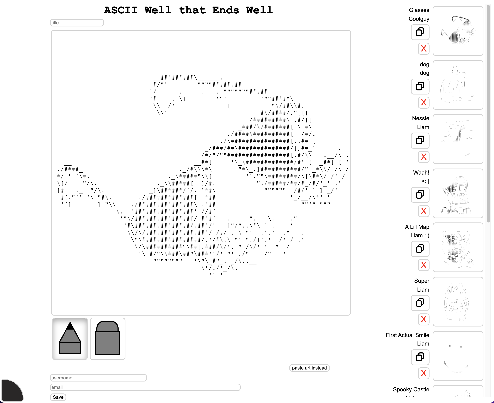
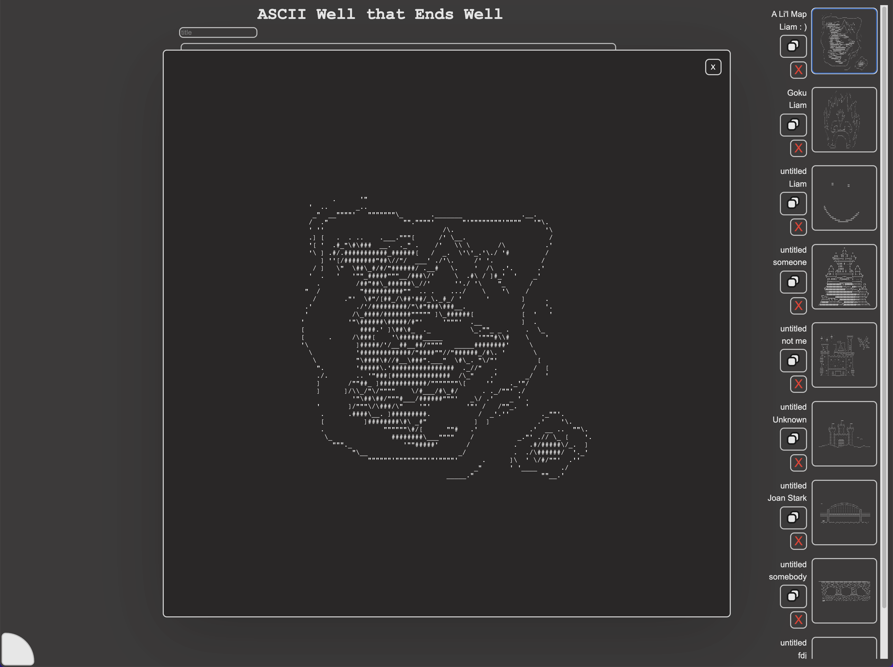

# ASCII Well that Ends Well #
Ascii Art for the Rest of Us

A little ascii drawing app, with a gallery to copy your art and paste it into any chat anywhere

### Technologies used
- MongoDB
- Express
- React
- Webpack
- Babel
- Sass
- Axios
### Screenshots

### Installation
- Install MongoDB
- Clone the repo
- cd into the repo directory
- `npm install`
- `npm run build`
- `npm start`
  - Linux users may need to `sudo npm start` to enable mapping port 80
  - For a persistent server, install PM2 and use `pm2 server` while in the repo root directory
- visit `localhost` in a browser to begin drawing and collecting art!

[Press release](./_PRESS-RELEASE.md)
